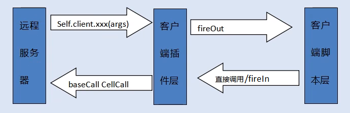

## Framework


## Server资产库目录结构
\<assets>
+ scripts
    + entities.xml          // 列出所有的entity
    + entity_defs       
        - <entity>.def      // entity定义文件，定义entity属性和方法
    + base                  // BaseApp脚本(*.py)
    + bots                  // 机器人压力测试脚本，简化模拟客户端(登录/AI),bots需要实现ClientMethod
    + cell                  // CellApp脚本
    + client                // ?Client脚本(使用Unity插件,经测试不会被调用此内脚本)
    + common                // 公用脚本(Cell/Base/Client共用的实现函数)
    + data                  // 服务端逻辑数据文件，比如策划导表数据
        - d_avatar_inittab.py  // 人物初始化数据,(spawnpos会用作副本的出生点)
        - d_dialogs.py         // 对话数据？？ 
        - d_entities.py        // Entity属性ID定义 数据
        - d_skills.py          // 技能数据？？
        - d_spaces             // 场景列表(场景名,角色出生点,resPath(路径必须存在)寻路数据等)
        - d_spaces_spawns.py   // 每个场景的怪物出生点数据
        + spawnpoints          // 每个场景的怪物出生点数据(xml格式可存放于此,叠加)
    + db                    // 数据库扩展
    + interface
    + logger
    + login
    + server_common         // 公用脚本(Cell/Base共用的实现函数)
    + user_type             // 自定义类型脚本
+ res
    + server
        - kbengine.xml      // 服务端配置文件
    + spaces                // 空间的资源数据，比如碰撞信息，寻路数据
1. 全局配置:kbe/res/server/kbengine_defs.xml
2. 本地配置:<assets>/res/server/kbengine.xml
3. app的主脚本(默认为kbemain.py)可在kbengine_defaults.xml->baseapp->entryScriptFile 配置
    ```xml
    <baseapp>
        <!-- 脚本入口模块， 相当于main函数 (Entry module, like the main-function) -->
        <entryScriptFile> kbemain </entryScriptFile>
    </baseapp>
    ```
    在服务器代码调用：
    ```cs
    if (getEntryScript().get() && PyObject_HasAttrString(getEntryScript().get(), "onReadyForShutDown") > 0) {
        // 所有脚本都加载完毕
        PyObject* pyResult = PyObject_CallMethod(getEntryScript().get(),
            const_cast<char*>("onReadyForShutDown"),
            const_cast<char*>(""));
        ...
    }
    ```
4. 账号Entity的名称(默认为Account)在kbengine_defs.xml->dbmgr->account_system->accountEntityScriptType 配置
    ```xml
    <dbmgr><account_system>
        <accountEntityScriptType> Account </accountEntityScriptType>  ...
    </account_system></dbmgr>
    ```
    在服务器端,baseapp.cpp:onQueryAccountCBFromDbmgr中创建Account
    ```cs 
    Proxy* base = static_cast<Proxy*>(createEntity(g_serverConfig.getDBMgr().dbAccountEntityScriptType,
            NULL, false, entityID));
    ```

## DataBase_Tables
```c entity_table.h
#define KBE_TABLE_PERFIX					"kbe"
#define ENTITY_TABLE_PERFIX					"tbl"
#define TABLE_ID_CONST_STR					"id"
#define TABLE_PARENTID_CONST_STR			"parentID"
#define TABLE_ITEM_PERFIX					"sm"
#define TABLE_ARRAY_ITEM_VALUE_CONST_STR	"value"
#define TABLE_ARRAY_ITEM_VALUES_CONST_STR	"values"
#define TABLE_AUTOLOAD_CONST_STR			"autoLoad"
```
1. 每种Entity会对应一个tbl_[entity]的表
2. def文件中每个Persistent为true的属性对应一个sm_[property]的table item
3. 附加一个名为sm_autoLoad的table item
4. 第一次创建Entity是临时的实体(Account实体除外), 如果想要写入到数据库必须主动调用一次writeToDB,之后就会定期自动存档
    + writeTodDB 在base/cell的Entity都有, base的多一个callback参数
    + shouldAutoLoad这个可选参数指定这个实体在服务启动的时候是否需要从数据库加载
        - 服务器启动时自动加载实体，底层默认将会调用createEntityAnywhereFromDBID将实体创建到一个负载最小的baseapp上，整个过程将会在第一个启动的baseapp调用onBaseAppReady之前完成
        - 脚本层可以在主脚本(默认是kbemain.py)中重新实现实体的创建方法，例如：
        ```python
            def onAutoLoadEntityCreate(entityType, dbid): 
                KBEngine.createEntityFromDBID(entityType, dbid)
        ```
5. def文件中

## Entity脚本/定义
官方文档[点此](http://kbengine.org/cn/docs/programming/entitydef.html)

### Account Entity的创建
1. 在服务器代码中会读取到 dbcfg.dbAccountEntityScriptType,然后通过如下代码创建Entity
    ```cs baseapp.cpp
    Proxy* base = static_cast<Proxy*>(createEntity(g_serverConfig.getDBMgr().dbAccountEntityScriptType,
            NULL, false, entityID));
    ```

### 其他Entity的创建
1. 在Python脚本中：
    ```python
    KBEngine.createBaseLocally('Avatar', props)
    ... or ...
    KBEngine.createBaseFromDBID("Avatar", dbid, self.__onAvatarCreated)
    ... or ...
    self.createCellEntity(space)  # create cell entity
    ```
2. 在服务器代码中：
    ```c
    APPEND_SCRIPT_MODULE_METHOD(getScript().getModule(), createBaseLocally, __py_createBase,METH_VARARGS, 0);
    APPEND_SCRIPT_MODULE_METHOD(getScript().getModule(), createBaseFromDBID, __py_createBaseFromDBID, 0);
    ... or ...
    SCRIPT_METHOD_DECLARE("createCellEntity", createCellEntity,	METH_VARARGS, 0) //base.cpp
    ...
    PyObject* Baseapp::__py_createBase(PyObject* self, PyObject* args){
        char* entityType = ...;   // Parse args to get entityType
        PyObject* e = Baseapp::getSingleton().createEntity(entityType, params);
        if(e != NULL) Py_INCREF(e);
        return e;
    }
    PyObject* Baseapp::__py_createBaseFromDBID(PyObject* self, PyObject* args){
        ...
    }
    ... or ...
    /** 为一个baseEntity在指定的cell上创建一个cellEntity,定义static method __py_createCellEntity */
    DECLARE_PY_MOTHOD_ARG1(createCellEntity, PyObject_ptr);  //base.h
    ```
3. 在客户端(如果hasClient为true):
BaseApp调用createClientProxies,向客户端发送Client_onCreatedProxies消息,消息参数包含Entity名字
Client_onCreatedProxies根据消息中的Entity名字在Entity类映射表中找到Entity类,创建实例

## 脚本的调用流程
1. baseapp.cpp:onQueryAccountCBFromDbmgr中创建Account entity
    ```cs 
    Proxy* base = static_cast<Proxy*>(createEntity(g_serverConfig.getDBMgr().dbAccountEntityScriptType,
            NULL, false, entityID));
    ```
2. base/Account.py中创建Avatar:
    + 新建：kbengine.createBaseLocally('Avatar', props), 然后 Avatar.WriteToDB
    + 从DB加载: kbengine.createBaseFromDBID('Avatar', dbid, onAvatarCreated)
    + self.giveClientTo(avatar) #将客户端控制权切换到Avatar身上
3. base/kbengine.py中创建spaces(多个space的管理器):
    + KBEngine.createBaseLocally( "Spaces", {} )
    + 保存在globalData["Spaces"]
4. base/spaces.py中根据场景表(data/d_spaces.py)创建多个space(以及一个SpaceDuplicate)
    |id|type|entityType|resPath|spawnPos|name|
    |-|-|-|-|-|-|-
    |1|1|Space         |spaces/xinshoucun              |(771.5861, 211.0021, 776.5501)|新手村
    |2|1|Space         |spaces/kbengine_ogre_demo      |(-97.9299, 0.0, -158.922)     |kbengine_ogre_demo      
    |3|1|Space         |spaces/kbengine_unity3d_demo   |(-97.9299, 1.5, -158.922)     |kbengine_unity3d_demo   
    |4|1|Space         |spaces/teleportspace           |(0.0, 1.5, 0.0)               |teleportspace  
    |5|2|SpaceDuplicate|spaces/duplicate               |(0.0, 0.0, 0.0)               |Duplicate(副本)
    |6|1|Space         |spaces/kbengine_cocos2d_js_demo|(108.0, 0.0, 90.0)            |kbengine_cocos2d_js_demo
    |7|1|Space         |spaces/kbengine_ue4_demo       |(-97.9299, 1.5, -158.922)     |kbengine_ue4_demo       
    + 根据以上数据创建spaceAlloc,createSpaceOnTimer中调用SpaceAlloc.init创建Space Entity:
    KBEngine.createBaseAnywhere(spaceData["entityType"],{"spaceUType" : self._utype,
                                                         "spaceKey" : spaceKey,
                                                         "context" : context,},
                                Functor.Functor(self.onSpaceCreatedCB, spaceKey))
    + 创建了六种Space Entity, 保存在globalData["Space_%i" % self.spaceID"]
    + 对于SpaceDuplicate,有对应的SpaceAllocDuplicate,将init重写为一个空函数,故不会在初始时创建baseapp Entity;
                         有对应的SpaceDuplicateContext, return {"spaceKey" : entity.dbid}
                         在onCheckDestroyTimer中检查没有玩家在内就Destroy
5. base/space.py的__init__中创建space的cell Entity:
    + self.createInNewSpace(None)   #在一个空间的cell上创建一个关联的实体，它请求通过cellappmgr来完成
6. base/space.py的loginToSpace中创建玩家Avatar的cell entity:
    + avatarMailbox.createCell(self.cell)
7. base/space.py的onTime创建SpawnPoint：
    + 从d_spaces_spawn.py中读取当前spaceType对应的SpawnPoint数据(d_spaces_spawns.py,xinshoucun数据定义在xml中)
    + 添加data/spawnpoints/[ResPath]_spawnpoints.xml(这里只有xinshoucun)中定义的SpawnPoint数据
    + KBEngine.createBaseAnywhere("SpawnPoint",{"spawnEntityNO" : datas[0],
                                                "position" : datas[1], 
                                                "direction" : datas[2], 
                                                "modelScale" : datas[3],
                                                "createToCell" : self.cell})
8. base/SpawnPoint.py创建cellapp的Entity:
    + self.createCellEntity(self.createToCell)
9. cell/SpawnPoint.py上创建Entities
    + KBEngine.createEntity(datas["entityType"], self.spaceID, tuple(self.position), tuple(self.direction), params)
    + Entities定义(d_entities.py)格式如下:

    |id|runSpeed|moveSpeed|dialogID|modelID|etype|entityType|name|
    |-|-|-|-|-|-|-|-|
    |80008001|60|30|0       |80008001|1|Monster|怪物8
注:
   1. addProximity添加trigger,响应函数是onEnterTrap, 在Monster和Gate都用到了
   2. Gate的onEnterTrap判断40001003则传回本space的出生点,其它传到space 3/4

## Player生成及所在的场景(spaceUType)
1. cellData是一个字典属性。每当base实体没有创建它的cell实体时，cell实体的属性会(从数据库读出)保存在这里. 除了cell实体在实体定义文件里指定的属性外，它还包含position, direction and spaceID
2. Teleport.def中定义的spaceUType(sm_spaceUType)存储Entity所在的space ID
3. 某个玩家请求登陆到某个space中: Avatar.onEntitiesEnabled==>Teleport.onEntitiesEnabled==>Space.loginToSpace
    + avatarMailbox.createCell(self.cell)

## Skill
1. Avatar->SkillBox: 为客户端提供接口对玩家的技能包的增删改查，以及提供UseTargetSkill来发动技能
2. Avatar/Monster->Spell
3. 对于玩家，Demo中在SkillBox的初始化中为调用self.skills.append为玩家添加技能
4. 对于Monster,Demo中直接在Ai.py的onThinkFight直接发技能
5. TODO:
    + 技能生命期管理
    + 技能CD管理
    + buff生命期管理
    + buff叠加/冲抵管理
    + AI的技能方案：1：与玩家统一；2：简化

## 任务链及进度管理


## AI Loop
1. onWitnessed
    + enable HeardBeatTime // one per one sec
2. onHeardBeatTime
    + Think
        - Free: 检查领地(范围触发器),RandomWalk
        - Fight: 战斗状态中,删除当前领地(避免重复进入战斗),战斗处理
        - Other
    + IsWitnessed check
        - false: disable
3. recvDamage/onEnterTrap(AI的范围触发器)
    + addEnemy
        - onAddEnemy: set 战斗状态


## 其他
1. Avatar的名字 tbl_avatar的sm_name为空导致脚本访问Avatar.nameB出错
2. Unity生成数据只来自于kbengine_unity3d_demo 
3. 输出log：self.getScriptName()


