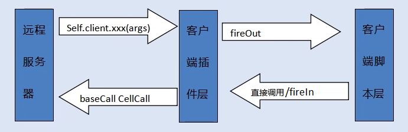

## Framework


## Configuaration
+ 定义在KBEMain中,通常写一个继承于KBEMain的类，包含
    - Debug Level
    - Is MultiThread
    - IP                ：LoginApp's IP
    - Port              : LoginApp's Port
    - Client Type       : py脚本可由self.getClientType()取得
        - UNKNOWN_CLIENT_COMPONENT_TYPE	= 0,
		- CLIENT_TYPE_MOBILE			= 1,// 手机类
		- CLIENT_TYPE_WIN				= 2,// pc， 一般都是exe客户端
		- CLIENT_TYPE_LINUX				= 3	// Linux Application program
		- CLIENT_TYPE_MAC				= 4	// Mac Application program
		- CLIENT_TYPE_BROWSER			= 5,// web应用， html5，flash
		- CLIENT_TYPE_BOTS				= 6,// bots， 从bots目录查找ClientMethod
		- CLIENT_TYPE_MINI				= 7,// 微型客户端

## Messages Binding/Sending/Recving/Handling 
在Unity插件内部
### Message constructor
    public Message(MessageID msgid, string msgname, Int16 length, sbyte argstype,
        List<Byte> msgargtypes, System.Reflection.MethodInfo msghandler);
### Message Table Construction 
1. bindFixedMessage: 构建默认Message Table

        Message.messages["Client_onHelloCB"] = new Message(521, "Client_onHelloCB", -1, -1, 
            new List<Byte>(), KBEngineApp.app.GetType().GetMethod("Client_onHelloCB"));
	    Message.clientMessages[Message.messages["Client_onHelloCB"].id] = 
            Message.messages["Client_onHelloCB"];
2. Import Client Messages: 根据服务器消息构建Message Table
    + PersistentInfos.LoadAll  // 在KBEngineApp.initialize时
        - 如果Cache的协议文件存在,加载并绑定消息,通常会覆盖bindFixedMessage
        - 协议文件包含：
            * client_interface.h中定义的全部消息协议
            * loginapp_interface.h中 标为 LOGINAPP_MESSAGE_EXPOSED 的消息协议
            * baseapp_interface.h中 标为 BASEAPP_MESSAGE_EXPOSED 的消息协议
            * 协议ID TODO：？？？？
            * 根据消息类别存到对应的Message Dictionary中
        - 绑定协议消息时会查找handler
            * typeof(KBEngineApp).GetMethod(msgname)  
        - serverErrorsDescr定义于server_errors.h 和 server_errors.xml
        - clientEntityDef定义于entities.xml 和 entity_defs/*.def
    + 如果Cache的协议文件不存在 或 Load失败，
        - 在Client_onHelloCB向服务器发送消息请求协议文件
        - 使用服务器应答构建Message Table
        - 存入Cache文件(AppData\LocalLow\kbengine\kbengine\*.*)
### Send Messages to Server
    Bundle bundle = Bundle.createObject();
    bundle.newMessage(Message.messages["Loginapp_importClientMessages"]);
    bundle.send(_networkInterface);
### Recv Message & Invoke Handler
    // in PacketReceiver.Process / MessageReader.Process
    msg.handleMessage(stream);    

## Event Registration/Firing
+ RegisterIn  : KBE插件(内部)中注册/定义的Event, 由UI/Render(外部) FireIn/触发 
+ RegisterOut : UI/Render(外部)注册/定义的Event, 由KBE插件(内部)中 FireOut/触发  
+ Event.FireIn/Out/All
+ Event.processInEvents/processOutEvents
+ Sample Flow : 
    + connectTo -> _asyncConnectCB
        - Event.fireIn("_onConnectionState", new object[] { state });
    + KBEMain.KBEUpdate -> KBEngine.Process -> 
        + Event.processInEvents -> _onConnectionState
            - Event.fireAll("onConnectionState", new object[] { success });
    + KBEMain.KBEUpdate -> 
        + Event.processOutEvents -> onConnectionState

## Message Flow
### With Valid Cache Files
|From Client                      | From Server | Description |
|-|-|-|
|ConnectTo 127.0.0.1:20013        |-|connect to loginapp |
|hello                            |Client_onHelloCB | 返回Digest与本地cache比对,一致
|Loginapp_login                   |Client_onLoginSuccessfully
|ConnectTo baseappIP:20015        |-|connect to baseapp
|hello                            |Client_onHelloCB
|Baseapp_loginBaseapp             |Client_onUpdatePropertys
|-                                |Client_onCreatedProxies
|Base_onRemoteMethodCall          |Client_onRemoteMethodCall

### Without Valid Cache Files
|From Client                      | From Server | Description |
|-|-|-|
|ConnectTo 127.0.0.1:20013        |-|connect to loginapp |
|hello                            |Client_onHelloCB | 返回Digest与本地cache比对,不一致
|importClientMessages             |Client_onImportClientMessages
|Loginapp_importServerErrorsDescr |Client_onImportServerErrorsDescr
|Loginapp_login                   |Client_onLoginSuccessfully
|ConnectTo baseappIP:20015        |-|connect to baseapp
|hello                            |Client_onHelloCB
|importClientMessages             |Client_onImportClientMessages
|Baseapp_importClientEntityDef    |Client_onImportClientEntityDef
|Baseapp_loginBaseapp             |Client_onUpdatePropertys
|-                                |Client_onCreatedProxies
|Base_onRemoteMethodCall          |Client_onRemoteMethodCall

### Heartbeat
|From Client | From Server | Description |
|-|-|-|
|Loginapp_onClientActiveTick|Client_onAppActiveTickCB
|Baseapp_onClientActiveTick|Client_onAppActiveTickCB

注:
1. baseappIP：baseappPort来自于Client_onLoginSuccessfully
2. 登录网关成功后,Client_onCreatedProxies为entity创建客户端实例(通过Entity名字反射,这里是Account)
3. Base_onRemoteMethodCall是角色Entity.basecall("reqAvatarList")时发送
4. Client_onRemoteMethodCall是因为服务端Account.py的reqAvatarList调用self.client.onReqAvatarList(self.characters)
5. LoginApp的心跳包通常仅在Login超时才可能收到,正常情况不会收到
6. Message name prefix ????

## Entity
http://kbengine.org/cn/docs/programming/entitydef.html
### Entity定义文件
Entity定义文件是由客户端发送Baseapp_importClientEntityDef从服务器端请求下来并且缓存。

### Entity 客户端/服务端 对应
1. onImportClientEntityDef时根据Entity名字反射查找到对应的Entity类,并建立string/type映射表
2. 登录网关成功后,BaseApp调用createClientProxies,向客户端发送Client_onCreatedProxies消息,消息参数包含Entity名字
3. Client_onCreatedProxies根据消息中的Entity名字在Entity类映射表中找到Entity类,创建实例

### 调用服务端方法
class Entity中定义了两个调用函数，本质是
1. 首先根据Entity的classname和methodname在本地缓存的Entity定义文件中查找到methodID
2. 然后与参数一起打包成Message用Bundle类向服务端发送：
这两个函数是:
1. basecall : 调用<BaseMethod>中标记了<Exposed>的方法，消息类型Base_onRemoteMethodCall
2. cellcall : 调用<CellMethod>中标记了<Exposed>的方法，消息类型Baseapp_onRemoteCallCellMethodFromClient

### 为Entity添加方法
以Account为例，为其添加一个MessageTest(UInt8),其中调用client的onMessageTest(UInt8)：
1. 在Account.def中定义方法
```xml
<BaseMethods>
    <MessageTest>
        <Exposed/>
        <Arg>	UINT8 		</Arg>
    </MessageTest>
</BaseMethods>
<ClientMethods>
    <onMessageTest>
        <Exposed/>
        <Arg>	UINT8 		</Arg>
    </onMessageTest>
</ClientMethods>
```
2. 在Account.py中添加BaseMethods：MessageTest实现
```python
def MessageTest(self, iid):
    INFO_MSG('Account::MessageTest:(%i) iid: %i' % (self.id, iid))
    self.client.onMessageTest(iid)
```
3. 因为onMessageTest也是通过Entity Id来调用的，所以onMessageTest需要添加在客户端的Account Entity
```cs
public void onMessageTest(Byte iid) { Debug.LogError("onMessageTest:"+iid); }
```
4. 调用
```cs
if (KBEngineApp.app.entity_type == "Account") {
    KBEngine.Account account = (KBEngine.Account)KBEngineApp.app.player();
    if (account != null) {
        account.baseCall("MessageTest", 22);
    }
}
```